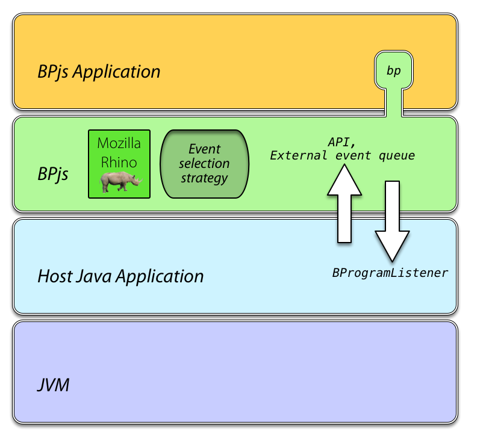
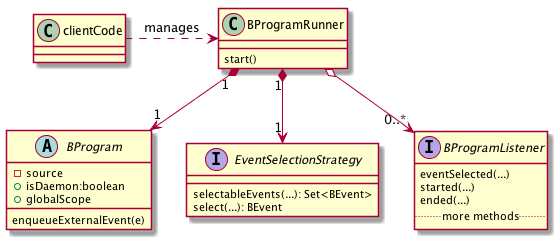

Embedding BPjs in an Application
================================

Overview
--------

The BPjs library can be embedded in larger Java programs. The setting is useful in
cases where you want the control logic to be implemented using behavioral programming,
and thus need to translate incoming signals to BP events, and selected BP events to
instructions to, e.g. actuators, databases, or web-services.

The layers of an application running a BPjs ``BProgram`` are described in the figure below.
The BP code (top layer) is the BPjs code, written in Javascript. It can interact with
the BPjs runtime using the :doc:`BPjsTutorial/bp-object`. The host application can make
other Java objects available to the Javascript code, as will be explained later.

The BPjs layer serves as a runtime environment for the BProgram. The host application has
to instantiate a ``BProgram`` object, and pass it to a ``BProgramRunner``. The host application
can listen to events of the running b-program (such as start, end, b-thread added, and - of course - b-event selected).
Additionally, the host application can provide custom event selection strategy, in case
the default one it not good enough.

  The layers of a running BPjs program. The BP program, written in Javascript,
  it the top layer. It interacts with the BPjs runtime using ``bp``,
  a Javascript object added to its context. The hosting Java application controls
  the BPjs runtime via its API. It can push event to the ``BProgram``'s external
  event queue, and register listeners that are invoked when events are selected.

  Class diagram describing the structure of an embedded b-program. The client code
  generates a BProgram and a BProgramRunner. The runner object consults the b-program's
  event selection strategy when selecting events for the b-program it runs. A list of
  listener objects are informed whenever an event of interest, such as b-thread
  addition or b-event selection, occurs.
  *Some methods and properties have been omitted for brevity.*

.. note::
  **Why is ``BProgram`` separated from ``BProgramRunner``?**

  Because a b-program is also
  a model that can be *verified* rather than *ran*. The same ``BProgram``
  object can be passed to a verifier object for verification.

Steps for B-Program Embedding
-----------------------------

Code setup
~~~~~~~~~~

Add BPjs to your classpath.

  See :doc:`install-bpjs`.

Decide which ``BProgram`` subclass you need.

  `BProgram`_ is an abstract class. Its concrete sub-classes differ on how they obtain their source code. `SingleResourceBProgram`_ reads the code from a resource included with the code (typically, a .js file bundled in the project's .jars). `StringBProgram`_, on the other hand, takes a Java String as source. Of course, ``BProgram`` can be directly extended as needed.

Write the BPjs code.

  The code will interact with the runtime using the ``bp`` object. Additional Java classes can be made available to it by using Rhino's `import directives`_, or by adding Java objects to the program's scope (see below).

At Runtime
~~~~~~~~~~

* Instantiate the proper ``BProgram`` sub-class, and supply it with the source BPjs code.
* If needed, set a new ``EventSelectionStrategy``. When no strategy is supplied, SimpleEventSelectionStrategy_ will by used. This strategy randomly selects an event from the set of events that are requested and not blocked.
* If needed, add Java objects to the global b-program scope using `putInGlobalScope`_.
* If the host Java program will push external events to the b-program, make the b-program wait for these events by calling ``bprog.setWaitForExternalEvents(true)``.
* Instantiate a ``BProgramRunner`` object, and supply it with the ``BProgram`` instance.
* Add listeners to the runner.
* In the common case when the program needs to wait for external events (such as GUI interactions), set the ``isDaemon`` property of the ``BProgram`` to ``true``.
* Call ``BProgramRunner::start()``.

The BProgram will start running. Life-cycle and behavioral events will be passed to the listener objects. In case the host application would like to push an external event to the embedded b-program (e.g. because of a network request, or a user click), it should use the ``BProgram``'s `enqueueExternalEvent`_ method.

.. tip::
  BPjs' source code contains many examples of embedded BPjs programs - most of the unit tests that involve a b-program. For a more complete example, refer to the `RunFile`_ class, which implements the command-line tool for running BPjs code.

.. tip::
  SampleBPjsProject_ can serve as a template project for embedding BPjs in a Java application. You can fork it on GitHub and start building your application from there.

External Events vs. Internal Events
~~~~~~~~~~~~~~~~~~~~~~~~~~~~~~~~~~~

There is no difference between external and internal events -- both are instances of the Java ``BEvent`` class, or a subclass of it. However, there may be a difference in how these events are treated by the event selection strategy. External events are made available to the strategy using an "external event queue". An event selection strategy may choose to ignore this queue whenever it can choose an event requested by a b-thread. But a strategy can also decide to choose an event from the queue even when there are internal events that are requested and not blocked.

All event selection strategies currently included with BPjs ignore external events when there are choosable internal ones. This choice makes the system easier to reason about, as it gets to complete its reaction to one external event before it starts reacting to a new one. But this does not *have* to be the case.

.. _import directives: https://developer.mozilla.org/en-US/docs/Mozilla/Projects/Rhino/Scripting_Java
.. _BProgram: javadoc.io/page/com.github.bthink-bgu/BPjs/latest/il/ac/bgu/cs/bp/bpjs/bprogram/runtimeengine/BProgram.html
.. _SingleResourceBProgram: javadoc.io/page/com.github.bthink-bgu/BPjs/latest/il/ac/bgu/cs/bp/bpjs/bprogram/runtimeengine/SingleResourceBProgram.html
.. _StringBProgram: javadoc.io/page/com.github.bthink-bgu/BPjs/latest/il/ac/bgu/cs/bp/bpjs/bprogram/runtimeengine/StringBProgram.html
.. _putInGlobalScope: javadoc.io/page/com.github.bthink-bgu/BPjs/latest/il/ac/bgu/cs/bp/bpjs/bprogram/runtimeengine/BProgram.html#putInGlobalScope-java.lang.String-java.lang.Object-
.. _enqueueExternalEvent: javadoc.io/page/com.github.bthink-bgu/BPjs/latest/il/ac/bgu/cs/bp/bpjs/bprogram/runtimeengine/BProgram.html#enqueueExternalEvent-il.ac.bgu.cs.bp.bpjs.events.BEvent-
.. _RunFile: https://github.com/bThink-BGU/BPjs/blob/develop/src/main/java/il/ac/bgu/cs/bp/bpjs/mains/RunFile.java
.. _SimpleEventSelectionStrategy: javadoc.io/page/com.github.bthink-bgu/BPjs/latest/il/ac/bgu/cs/bp/bpjs/eventselection/SimpleEventSelectionStrategy.html
.. _SampleBPjsProject: https://github.com/bThink-BGU/SampleBPjsProject
