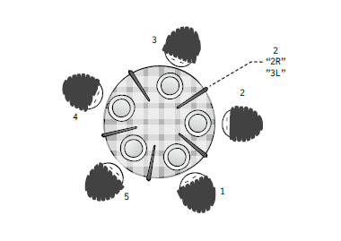

*****************************
Example - Dining Philosophers
*****************************

.. include example-dining-philosophers::

The Dining Philosophers is a classic concurrent programming challenge, first proposed as an exercise in an exam by Edsger Dijkstra in 1965. Imagine a group of philosophers, sitting at a round table. Each has a plate with food. For utensils, they have chopsticks - a single chopstick between each two plates (this setting correctly models the event budget of many Philosophy departments). In order to eat, each philosopher has to obtain both chopsticks adjacent to her.
The concurrency challenge is, of course, mutual exclusivity: A chopstick may only be held by a single philosopher at any given moment, and so they have to either coordinate, or experience hunger-induced existential crisis. This problem is illustrated in Figure 1.

The philosophers in our dining philosophers b-program use a naive algorithm, listed in Listing 1: a philosopher picks up the chopstick to their right, then the one to their left, eats, puts the left chopstick down, puts the right chopstick down, and then starts over again. While intuitive, this algorithm reaches a deadlock in a certain scenario we will automatically discover later.

The code in Listing 1 consists of a regular JavaScript function. This function adds the new b-thread to the b-program, based on the parameters it was invoked with. Functions like these can be viewed as parametrized b-thread templates. In this example, b-thread templates are used to reduce code duplication.

We now turn our attention to the chopsticks. In the modeled setting, each chopstick is shared by the two philosophers adjacent to it. Each of these philosophers can pick up and release said chopstick.

   Dijkstra’s Dining Philosophers problem. Each two philosophers share the chopstick between them. In order to eat, a philosopher has to pick up both sticks. After eating, a philosopher releases the sticks and thinks. Since only a single philosopher can use a stick at any given moment, this setting poses many mutual exclusion challenges.

.. literalinclude:: Examples_code/Phil_listing1.js
  :linenos:
  :language: javascript

A function for adding a philosopher to the dining philosophers b-program. A dining philosopher repeatedly attempts to pick the chopstick to her right, then the one to her left, and then releases them in the same order. For the purpose of this program, there’s no need to add an EAT or THINK event.

Some restriction apply, though: a philosopher can only pick up a chopstick when it lays on the table,  and can only release a chopstick after picking it up. Additionally, a chopstick can be picked up by at most a single philosopher at a time. Consequentially, if one philosopher have picked a chopstick up, the other philosopher has to wait for the first philosopher to release the chopstick, prior to picking it up herself. Imposing these constraints is done by the chopstick b-thread. The code for adding a these b-threads is shown in Listing 2.

The implementation of chopstick b-threads demonstrates some interesting features of BP and BPjs. First, note the usage of event sets in lines 5 and 9. These are used to detect the pick up and release event of the stick being modeled.

.. literalinclude:: Examples_code/Phil_listing2.js
  :linenos:
  :language: javascript

A function for adding a chopstick to the dining philosophers bprogram. This b-thread ensures that the chopstick it models can be picked up by at most a single philosopher at a time. Note the usage of event sets for detecting Pick and Release events — this is needed, since philosophers adjacent to a stick refer to it using different names. For example, the stick between philosophers 3 and 4 would be referred to as 3R by philosopher 3, and 4L by philosopher 4.

The philosophers adjacent to a stick refer to it using different names. Thus, picking up stick #2 can be done using events ``Pick2R`` or ``Pick3L``. These events are contained in the
``pickMe`` event set defined in line 5. Set membership is determined by examining the event name, which is a regular JavaScript string object. Event sets created in BPjs are similar to mathematical sets: a predicate over events (although BPjs allows naming them too). Unlike set implementations in common collection frameworks, it is impossible to iterate over their members. Consequentially, it is meaningless to request such an event set during a bsync. doing so will cause BPjs’ runtime engine to throw an error.

The ``releaseMe`` event set, on the other hand, is an array of event objects. When such arrays are passed to bsync , they are treated as an event set. This type of event set can be requested during a
``bp.sync``, using the same syntax for requesting a single event. The exact semantics of requesting an event array are decided by the event selection strategy. It can ignore the order of elements, giving the array  *mathematical set*  semantics. Alternatively, it can consider the order of elements and select the first element that is not blocked by other bthreads, giving the array *preference queue* semantics. Event
selection strategies are covered in detail in Subsection VIII-A.
Having described the philosophers and chopsticks, it is now time to bring them all to the table. This is done using a regular JavaScript loop, shown in Listing 3.

*Discussion:* The dining philosophers b-program described here can serve both as a simulation program and as a model to be checked. For simulation purposes, this b-program is run (see Section V), and its event log can be analyzed, e.g. to get statistics about stick wait times. For verification, the b-program
is passed to a verification engine, as shown in Section VI.

.. literalinclude:: Examples_code/Phil_listing3.js
  :linenos:
  :language: javascript

The loop instantiating a dining philosophers model. If PHILOSOPHER_COUNT was not passed by the containing Java application, it defaults to 5.

.. figure::  images/Phil_fig2.png
   :align:   center

   A maze, described using our maze-description DSL (left), and a maze solution, found by a generic b-program model checker (right). The model checker output, an event sequence, was post-processed by the program to visualize the solution on the maze’s map. In both cases, the exact same code is used — no translation is necessary when transitioning between code execution and verification.

This example uses parametrized templates to create its bthreads. B-thread templates are a versatile and commonly used design pattern, applicable in various contexts. When creating simulations, b-thread templates can be used to generate heterogeneous b-thread population, where the template parameters are sampled from a given distribution. In the next section, they are used to create an interpreter for a small DSL.
